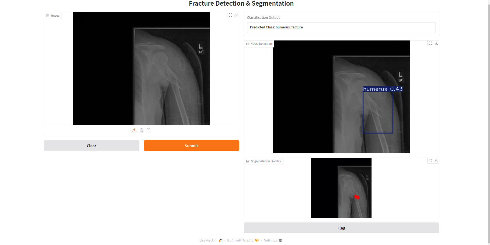

# Bone-fracture-detection
Deep learning pipeline for bone fracture detection from X-ray images using YOLOv8, EfficientNet, and UNet. Includes multitask learning, model comparisons, and a Gradio-powered UI for real-time inference.

## Dataset

- Source: [Kaggle - pkdarabi/bone-fracture-detection](https://www.kaggle.com/datasets/pkdarabi/bone-fracture-detection-computer-vision-project)
- Includes bounding box annotations for different types of fractures.

## Models Used
### 1. YOLOv8 for Object Detection
Trained for 30 epochs with imgsz=640, batch=32

Best model saved and evaluated on validation + test set

### 2. Multitask Model (Single)
#### Backbone: EfficientNetB0 (classification)
#### Decoder: UNet (segmentation)
#### Loss:
- Binary: BCEWithLogitsLoss
- Multiclass: CrossEntropyLoss
- Segmentation: DiceLoss
#### Performance:
- Binary Accuracy (Fracture vs No Fracture): 0.7751
- Multi-Class Accuracy (Fracture Type): 0.7692
- Dice Score: 0.3071
- IoU Score: 0.1987

### 3. Separate Classification + Segmentation Models
#### Classification: EfficientNetB1
#### Segmentation: UNet with ResNet34 encoder
#### Performance:
- Classification Accuracy: 0.6864
- Segmentation Dice: 0.5105, IoU: 0.5037

## Gradio Demo

Here is the final Gradio interface combining YOLOv8 detection, classification, and segmentation:

